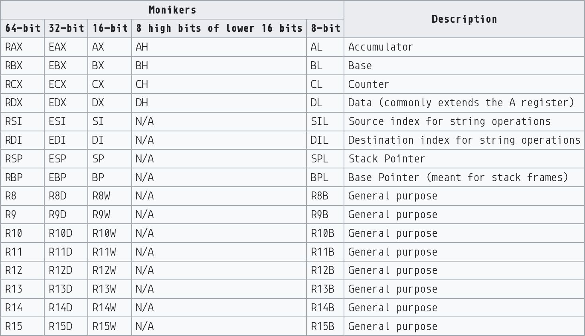

# x86 Assembly Guide

## Registers

All CPUs have certain registers that are basically their immediate working memory



`rax`: usually stores return values of functions and is going to be seen a lot

## Memory and Addressing Modes

We know our program is loaded into memory (RAM), we need a way to access this memory in assembly. We do so with memory addresses

```nasm
mov rax, [rbx]    ; move the 8 bytes in memory at address rbx into rax
```

### Size Directives

- `BYTE`: 1 byte
- `WORD`: 2 bytes
- `DWORD`: 4 bytes
- `QWORD`: 8 bytes

```nasm
mov WORD PTR [ebx], 2   ; move the 2 byte representation of "2" into memory at ebx
```

## Instructions

Instructions are the actual operations your machine supports. Nothing can happen on your machine if it doesn't happen through an instruction. 


### Data movement

```nasm
mov   ; copy data

push  ; push value onto stack

pop   ; pop top of stack into source

lea   ; load effective address
```

### Arithmetic and Logic instructions

```nasm
add   ; lmao

sub   ; lol

inc   ; increment
dec   ; decrement

imul  ; integer multiplication

idiv  ; integer division

and   ; rofl
or    ; cmon
xor   ; exclusive or (please tell me if you don't know what this is, i will explain)
not   ; do i need to

neg   ; negate

shl   ; shift left
shr   ; shift right
```

These arithmetic operations often set CPU flags

### Control Flow Instructions

We label instructions with `label:` when writing assembling, when reading disassembled output we usually refer by address

```nasm
_start: 
  xor ecx, ecx
  mov eax, [esi]
  jmp main


main:
  push rbp
```

```nasm
jmp   ; jump to label
je    ; jump when equal
jne   ; jump when not equal
jz    ; jump when last result was zero
jg    ; jump when greater than
jge   ; jump when greater or equal
jl    ;
jle   ;
```

eg

```nasm
cmp eax, ebx
jle done
```

radare2 is fantastic for visualising control flow

## Calling Convention


To protect the state of the program memory between functions programmers adopt a convention. When functions are called and returned from, the state of the registers must be protected, i.e. they must be saved and restored. To save them we push them to the stack, to restore them we pop them from the stack

To define exactly which ones are pushed where we need our convention

### Caller Rules

1. Save the values of 
    - `rax`
    - `rcx`
    - `rdx`
1. Pass parameters to the subroutine
    - via registers `rdi/rsi` etc
    - or via the stack
1. Call the subroutine via the 
    - `call` instruction

```nasm
; The subroutine executes now
```

1. Remove the parameters from the stack
1. Restore the contents of the saved registers

eg

```nasm
push [var] ; Push last parameter first
push 216   ; Push the second parameter
push eax   ; Push first parameter last

call _myFunc ; Call the function (assume C naming)

add esp, 12
```

### Callee Rules

1. maintain the base pointer 

    ```nasm
    push rbp
    mov rbp, rsp
    ```

1. allocate local variables by making space on the stack

    ```nasm
    sub rsp, 12    ; 12 bytes for local variables, i.e. 3 integers
    ```

1. save the value of registers
    - `rbx`
    - `rdi`
    - `rsi`
    - (`rsp` and `rbp` should also be preserved)

```nasm
;; execute subroutine
```

1. Leave the return value in `rax`
1. Restore the saved registers
1. Deallocate local variables
    
    ```nasm
    add rsp, 12
    ;; or
    mov rsp, rbp
    ```

1. restore base pointer

    ```nasm
    pop rbp
    ```

1. Return from subroutine

    ```nasm
    ret
    ```

eg

```nasm
.486
.MODEL FLAT
.CODE
PUBLIC _myFunc
_myFunc PROC
  ; Subroutine Prologue
  push ebp     ; Save the old base pointer value.
  mov ebp, esp ; Set the new base pointer value.
  sub esp, 4   ; Make room for one 4-byte local variable.
  push edi     ; Save the values of registers that the function
  push esi     ; will modify. This function uses EDI and ESI.
  ; (no need to save EBX, EBP, or ESP)

  ; Subroutine Body
  mov eax, [ebp+8]   ; Move value of parameter 1 into EAX
  mov esi, [ebp+12]  ; Move value of parameter 2 into ESI
  mov edi, [ebp+16]  ; Move value of parameter 3 into EDI

  mov [ebp-4], edi   ; Move EDI into the local variable
  add [ebp-4], esi   ; Add ESI into the local variable
  add eax, [ebp-4]   ; Add the contents of the local variable
                     ; into EAX (final result)

  ; Subroutine Epilogue 
  pop esi      ; Recover register values
  pop  edi
  mov esp, ebp ; Deallocate local variables
  pop ebp ; Restore the caller's base pointer value
  ret
_myFunc ENDP
END
```
